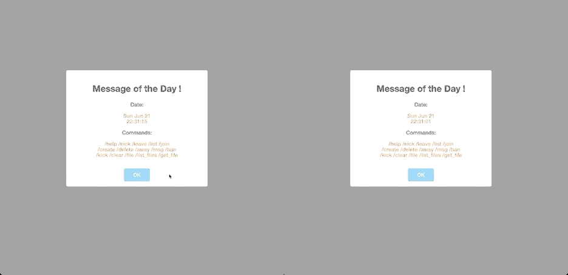
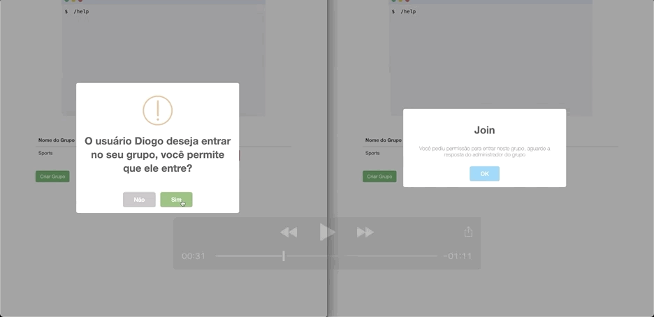
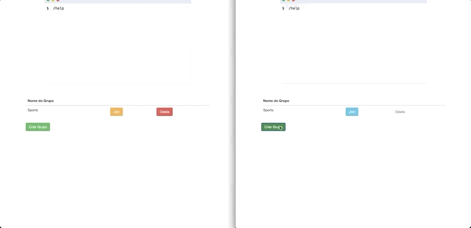

# Internet Relay Chat (IRC)

## Description

This project is a clone of Iternet Relay Chat (IRC), a real time messaging app where people can join channels to chat with a group of people. The access of this kind of service requires the use of a client application that connects to the IRC through a server application. We can find a bunch of RFC's about the implementation of such application, but in this repository you will find a simplified version implemented during a computer network class in Universidade de Brasília (UnB).

## Setup

First you need to install all dependencies

- npm install

Then you should start the server

- node server.js

After that you can acess the site at

- localhost:3000

## Usage Examples

